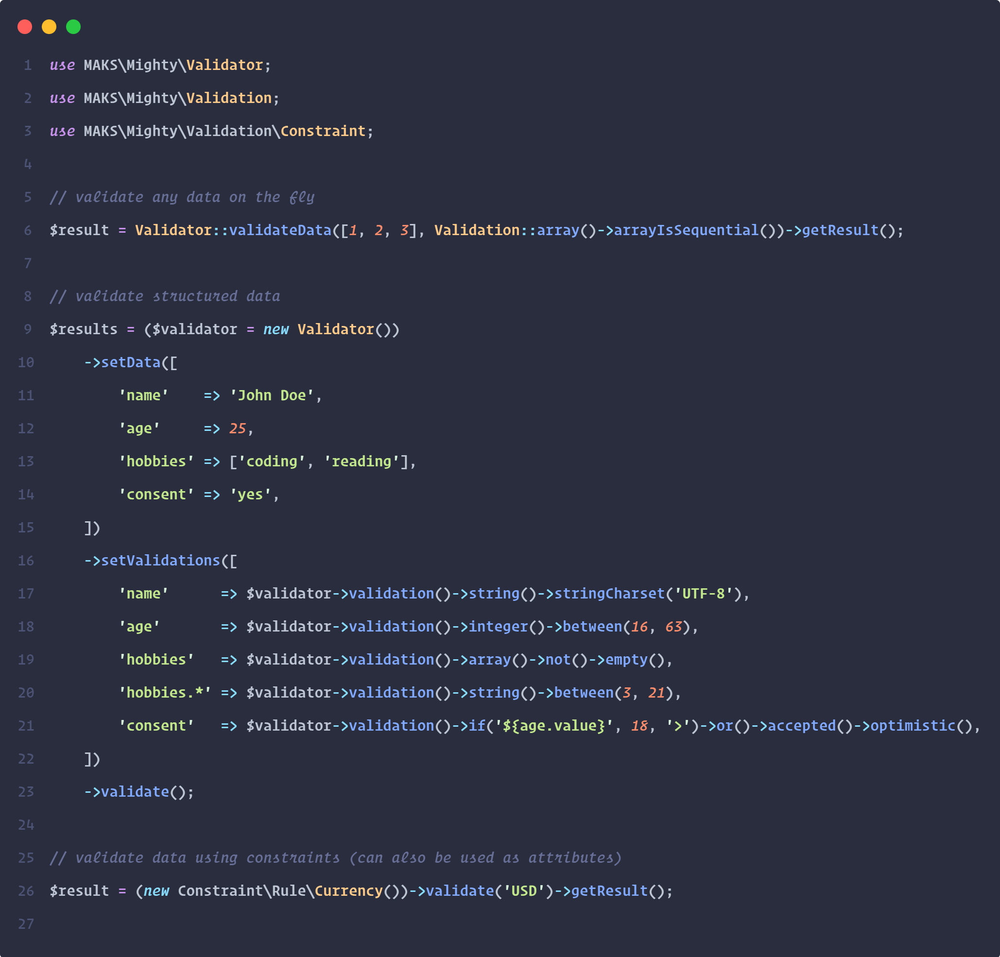

<h1 align="center">Mighty</h1>

<p align="center">
    
</p>

<p align="center">The last validation library you will ever need!</p>

<div align="center">

[![PHP Version][php-icon]][php-href]
[![Latest Version on Packagist][version-icon]][version-href]
[![Total Downloads][downloads-icon]][downloads-href]
[![License][license-icon]][license-href]
[![Maintenance][maintenance-icon]][maintenance-href]
[![Documentation][documentation-icon]][documentation-href]
<br>
[![GitHub Continuous Integration][github-ci-icon]][github-ci-href]
[![GitHub Continuous Deployment][github-cd-icon]][github-cd-href]
[![Codecov][codecov-icon]][codecov-href]
<!-- [![Codacy Coverage][codacy-coverage-icon]][codacy-coverage-href] -->
<!-- [![Codacy Grade][codacy-grade-icon]][codacy-grade-href] -->

[![Open in Visual Studio Code][vscode-icon]][vscode-href]

[![Tweet][tweet-icon]][tweet-href] [![Star][github-stars-icon]][github-stars-href]

<details>
<summary>Table of Contents</summary>
<p>

[Installation](#installation)<br/>
[About Mighty](#about-mighty)<br/>
[Quickstart](#quickstart)<br/>
[mVEL](#mighty-validation-expression-language)<br/>
[Examples](#examples)<br/>
[Constraints](#constraints)<br/>
[Validations](#validations)<br/>
[Documentation](https://marwanalsoltany.github.io/mighty/docs/api)<br/>
[Specification](./SPECIFICATION.md)<br/>
[Changelog](./CHANGELOG.md)<br/>

</p>
</details>

<br/>

<sup>If you like this project and would like to support its development, giving it a :star: would be appreciated!</sup>

<br/>

</div>


---


## Key Features

1. Zero dependencies.
2. Framework agnostic, can be integrated in any codebase.
3. Expressive, intuitive and easy to get along with over **250** built-in validation rules.




---


## Installation

```sh
composer require marwanalsoltany/mighty
```


---


## About Mighty

Validation is a common task in any web application. Data passed to the application via forms —or any type of input for that matter— must always be validated against a set of rules. Mighty can handle in an easy and expressive way.

Mighty is fast, powerful, robust, and easy to use validation library that is just fun to work with, it makes validating any data a breeze. Thanks to the power of the [**Mighty Validation Expression Language (mVEL)**](./SPECIFICATION.md) it is not like anything you've seen before. With its validation approach and over **250** built-in rules there is pretty much nothing that you cannot validate with it, in a very expressive and compact manner. Simply put, Mighty is validation on steroids! It is indeed the last validation library you will ever need.

Mighty provides several different approaches to validate data. It's most common use-case is validating incoming data via HTTP requests, but it of course is not limited to that; Mighty provides also attributes in the form of constraints to easily validate models and/or any kind of objects.

Mighty includes a wide variety of convenient validation rules that you may apply as a single rule or combine them with each other using operators to build up even more complex validations.

## Quickstart

To learn about Mighty's powerful validation features, let's cut straight to the point and take a look at some examples:

### General Data Validation

Validating form data using the `Validator::class`:

```php

use MAKS\Mighty\Validator;

$validator = new Validator();

$validator
    ->setData([
        'name'     => 'John Doe',
        'username' => 'john.doe',
        'password' => 'Super@Secret#123',
        'email'    => 'john@doe.com',
        'hobbies'  => ['coding', 'design', 'sports'],
    ])
    ->setValidations([
        // required&string&between:3,255
        'name'      => $validator->validation()->required()->string()->between(3, 255),
        // required&string&matches:/[a-z0-9._-]/i
        'username'  => $validator->validation()->required()->string()->matches('/[a-z0-9._-]/i'),
        // required&string&min:8
        'password'  => $validator->validation()->required()->string()->min(8),
        // required&email
        'email'     => $validator->validation()->required()->email(),
        // null^(required&array&max:5)
        'hobbies'   => $validator
            ->validation()
            ->null()
            ->xor()
            ->group(fn ($validation) => $validation
                ->array()
                ->max(5)
            ),
        // null|(if:${hobbies.validations.array}&(string&min:3))
        // hobby can be null or a string with at least 3 characters if hobbies is an array
        'hobbies.*' => $validator
            ->validation()
            ->null()
            ->or()
            ->group(fn ($validation) => $validation
                ->if('${hobbies.validations.array}')
                ->open()
                ->string()
                ->min(3)
                ->close()
            ),
    ])
    ->validate();

$result = $validator->isOK(); // boolean result of the overall validation result

$errors = $validator->getErrors(); // an array of results of validations that failed

$results = $validator->getResults(); // an array of results of all validations

$validator->check(); // void or throws an exception with a nicely formatted message of what exactly went wrong

```

### Objects Validation

Validating the state of an object using `Constraint::class` attributes:

```php

use MAKS\Mighty\Validation\Strategy;
use MAKS\Mighty\Validation\Behavior;
use MAKS\Mighty\Validation\Operator;
use MAKS\Mighty\Validation\Constraint;
use MAKS\Mighty\Validation\Constraint as Assert;
use MAKS\Mighty\Validation\Constraint\ValidatableObjectInterface;
use MAKS\Mighty\Validation\Constraint\ValidatableObjectTrait;


class ValidatableObject implements ValidatableObjectInterface
{
    use ValidatableObjectTrait;


    #[Assert\Rule\Equals('CONST')]
    public const CONST = 'CONST';

    #[Assert\Rule\In(['STATIC', 'VAR'])]
    public static $static = 'VAR';

    #[Assert\Rule\StringConstraint]
    #[Assert\Rule\StringCharset('UTF-8')]
    #[Assert\Rule\Between(3, 99)]
    public $default = 'DEFAULT';

    #[Assert\Rule\StringConstraint]
    #[Assert\Rule\StringContains('<element>')]
    #[Assert\Rule\Xml]
    public $xml = '<?xml version="1.0"?><element></element>';

    #[Assert\Rule\ArrayConstraint]
    #[Assert\Shape([
        'string' => new Assert\Rule\Str,
        'array'  => new Assert\Rule\Arr,
    ])]
    public $array = [
        'string' => 'value',
        'array'  => [],
    ];

    #[Assert\Rule\ObjectConstraint]
    #[Assert\Rule\ObjectIsInstanceOf(ValidatableObjectInterface::class)]
    #[Assert\Valid(message: 'Not valid')]
    public $object;

    #[Assert\Callback('is_scalar', 'Data is not scalar')]
    #[Constraint('string&min:3', strategy: Strategy::FailLazy, messages: [
        'string' => 'Must be string.',
        'min'    => 'Must be longer than ${@arguments.0}.',
    ])]
    public function getDefault()
    {
        return $this->default;
    }

    #[Assert\Compound([
        new Assert\Rule\Str,
        new Assert\Compound([
            new Assert\Rule\Arr,
            new Assert\Compound([
                new Assert\Rule\Blank,
            ], Operator::Not),
        ], Operator::And),
    ], Operator::Xor, Behavior::Pessimistic, Strategy::FailLazy)]
    public static function getStaticProperty()
    {
        return static::$static;
    }
}

$object = new ValidatableObject();

$result = $object->isValid(); // boolean result of the overall validation result

$results = $object->validate(); // an array of results of all validations

$object->check(); // void or throws an exception with a nicely formatted message of what exactly went wrong

```

An example of the output of validating a validatable object would look like this:

```php

// check out the previous snippet see the used constraints

$object = new ValidatableObject();
$object->object = new class implements ValidatableObjectInterface {
    use ValidatableObjectTrait;
    // some properties and their validation constraints ...
};
$object->default = null; // this must be a string

$object->check();

// ValidationFailedException::class
// Data failed to pass the validation.
// (01) The value (null) of the "ValidatableObject->default" property failed to pass the validation [string]. Problem: Value must be a string.
// (02) The value (null) of the "ValidatableObject->default" property failed to pass the validation [string.charset:"UTF-8"]. Problem: Value must be encoded in one of the following charsets: ["UTF-8"].
// (03) The value (null) of the "ValidatableObject->default" property failed to pass the validation [between:3,99]. Problem: Value must be between 3 and 99 or have a value/count/length that is between 3 and 99.
// (04) The return value (null) of the "ValidatableObject->getDefault()" method failed to pass the validation [callback]. Problem: Data is not scalar.
// (05) The return value (null) of the "ValidatableObject->getDefault()" method failed to pass the validation [string&min:3]. Problems: Must be string; Must be longer than 3.

```

Check also [`ValidatableObject`](./Tests/Mocks/ValidatableObject.php) and [`ValidatableObjectChild`](./Tests/Mocks/ValidatableObjectChild.php).

 **Hint:** *More examples can be found in the [Examples](#examples) section.*


---


## Mighty Validation Expression Language

Mighty has the concept of Validation Expression. The Validation Expression in its simplest forms is just a string that describes how Mighty should validate the given data. These strings are based on the [Mighty Validation Expression Language Specification (mVEL)](./SPECIFICATION.md).
mVEL is pretty simple, human-readable and easy to cope with.
It is a combination of well established concepts and/or specifications like [Boolean Algebra](https://en.wikipedia.org/wiki/Boolean_algebra), [Bitwise Operators](https://en.wikipedia.org/wiki/Bitwise_operation#Bitwise_operators), [JSON](https://en.wikipedia.org/wiki/JSON), and [CSV](https://en.wikipedia.org/wiki/Comma-separated_values).

Therefore, Validation Expression may be defined as a string that contains some rules separated by **Bitwise Operators** which will build an expression that when evaluated using **Boolean Algebra** logic, will result in the final result of the validation. The rules can have arguments, the types of these arguments can be denoted using the same rules of **JSON** types. A rule can also have multiple arguments and the arguments are separated by commas (**CSV**).

For example &nbsp;`required&string&between:2,255|null`&nbsp; is a valid Validation Expression, this expression can be understood as the following:

1. The expression has four rules.
2. The expression contains the rules:
   1. `required` Asserts that the input is present.
   2. `string` Asserts that the input is a string.
   3. `between:2,255` Asserts that the input is a string with a length between 2 and 255.
   4. `null` Asserts that the input is null.
3. The final result is the result of evaluating the expression resulting from the result of each rule glued together using bitwise operators.

The `required&string&between:2,255|null` expression means that the input must be present; **AND** of type string; **AND** between 2 and 255 in length; **OR** null. So it's a nullable string that when is not null must be between 2 and 255 characters long.

Lets say the the input was `"Mighty is Awesome!"`, the result of the expression `required&string&between:2,255|null` against that input would be `1&1&1|0` which will result in `1` which is `true`, if the input was `null` the result would be `0&0&0|1` = `1`, if the input was `X` the result would be `0&0&0|0` = `0`, etc ...

Unlike other validations implementations, the concept of **Boolean Algebra** using **Bitwise Operators**, gives the possibility to build up complex validations that are very readable and compact while keeping the rules to a minimum number, reusing existing logic in reversed or compound manner, and finally keeping the code base as DRY as it can be. The benefits can be summarized in the following points:

1. A rule can be **NOT**ed (using `~`) to do the exact opposite of what it normally does.
2. A complex rule can be the result of **AND**ing (using `&`), **OR**ing (using `|`), or **XOR**ing (using `^`), two or more simple rules.
3. Rules can be grouped together and/or given higher precedence by using parentheses, namely **OPEN** (using `(`) and **CLOSE** (using `)`).
4. A Validation Expression can also have behavior, which is a character the prefixes the Validation Expression string that will affect all rules. Available behaviors are:
   1. **NORMAL**: execute all rules, default behavior (no prefix).
   2. **OPTIMISTIC**: stop executing rules after the first success (`?` prefix).
   3. **PESSIMISTIC**: stop executing rules after the first failure (`!` prefix).
5. Readability can be improved by aliasing some rules or adding rules sets as macros and executing them using the `[macro]` syntax.

Also the concept of **JSON** ensures arguments data-types safety, and the concept of **CSV** makes sure the arguments list has clear parsing rules.

The nicest thing, you don't have to memorize all the rules nor the Validation Expression Language syntax. The [`Validation`](./Validation.php) class is a fluent interface that can be used to build a Validation Expression. It knows about all Mighty available rules and has full IDE-Intellisense support to make it as easy as it gets. For example:

```php

use MAKS\Mighty\Validation;

// the validation expression: `required&string&between:2,255|null`
// can be constructed using the Validation::class as follows:
$validation = (new Validation())->required()->string()->between(2, 255)->or()->null(); // AND is the default operator
// or statically:
$validation = Validation::required()->string()->between(2, 255)->or()->null();

```

 **Fact:** *It usually takes more words to describe what a validation expression does than the validation expression itself!*


---


## Examples

Here are some examples of real world scenarios:

### Validating a Single Value

```php

use MAKS\Mighty\Validator;

$result = ($validator = new Validator())
    ->validateOne(
        '123',
        $validator
            ->validation()
            // can be an integer or float or a string that is numeric
            // this example is only for demonstration only,
            // the same result can be achieved using numeric() only
            ->integer()->or()->float()->or()->group(
                fn ($validation) => $validation->string()->and()->numeric()
            )
    )
    ->toArray();

// $result would look something like this:
[
    'value' => '123',
    'result' => true,
    'validations' => [
        'integer' => false,
        'float' => false,
        'string' => true,
        'numeric' => true,
    ],
    'errors' => [],
    'metadata' => [
        'basis' => 'integer|float|(string&numeric)',
        'rules' => 'integer|float|(string&numeric)',
        'expression' => '0|0|(1&1)',
    ],
];

// you can also simply use the static helper Validator::validateData($data, $validation);
```

### Validating Structured Data

```php

use MAKS\Mighty\Validator;
use App\Service\HaveIBeenPwnedService as PasswordService;

$validator = new Validator();

$data = [
    'name'       => 'John Doe',
    'age'        => 32,
    'email'      => 'john.doe@domian.tld',
    'username'   => 'john.doe',
    'password'   => 'Secret@123',
    'image'      => '/path/to/image.png',
    'submission' => 'now',
    'consent'    => 'yes',
    'data'       => [
        'nickname' => 'JOE',
        'number'   => 7,
        'hobbies'  => [
            'coding',
            'cooking',
            'reading',
        ]
    ],
];

$validations = [
    'name'           => $validator->validation()->required()->string()->stringCharset(['UTF-8', 'ASCII'])->pessimistic(),
    // or using mVEL => required&string&string.charset:'["UTF-8","ASCII"]'
    'age'            => $validator->validation()->required()->integer()->min(18),
    // or using mVEL => required&integer&min:18
    'email'          => $validator->validation()->required()->email()->macro('gmail'),
    // or using mVEL => required&email&[gmail]
    'username'       => $validator->validation()->required()->username(),
    // or using mVEL => required&username
    'password'       => $validator->validation()->required()->password()->callback(fn ($input) => !PasswordService::isPwned($input)),
    // or using mVEL => required&password (NOTE: callback ist not possible, it requires a Validation::class instance that is bound to the Validator::class instance)
    'image'          => $validator->validation()->null()->xor()->group(fn () => $this->image()->imageDimensions(1920, 1080, '<=')),
    // or using mVEL => null^(image&image.dimensions:1920,1080,"<=")
    'submission'     => $validator->validation()->required()->datetime()->datetimeLt('2022-12-07'),
    // or using mVEL => required&datetime&datetime.lt:"2022-12-07"
    'consent'        => $validator->validation()->assert('${age.value}', 18, '>=')->or()->accepted()->or()->assertEquals('${this}', 'granted')->optimistic(),
    // or using mVEL => ?assert:${age.value},18,">="|accepted|assert.equals:${this},"granted"
    'data'           => $validator->validation()->required()->array()->arrayHasKey('nickname'),
    // or using mVEL => required&array&array.hasKey:"nickname"
    'data.*'         => $validator->validation()->scalar()->or()->array()->optimistic(),
    // or using mVEL => ?scalar|array
    'data.nickname'  => $validator->validation()->string()->min(2)->max(32),
    // or using mVEL => string&min:2&max:32
    'data.hobbies.*' => $validator->validation()->ifEq('${data.hobbies.validations.array}', false)->or()->group(fn () => $this->string()->min(3)),
    // or using mVEL => if.eq:${data.hobbies.validations.array},false|(string&min:3)
];

$labels = [
    'name'     => 'Name',
    'age'      => 'Age',
    'email'    => 'E-Mail',
    'password' => 'Password',
    'image'    => 'Image',
    'data'     => 'Data',
    'data.*'   => 'Value of data',
    'consent'  => 'Consent',
];

$messages = [
    '*' => [ // this will be expanded for all fields
        'required' => '${@label} is a required field.',
    ],
    'age' => [
        'min' => '${@label} must be at least ${@arguments.0}.',
    ],
    'username' => [
        'matches' => '${@label} must contain letters, numbers, and the following characters ".-_" only.',
    ],
    'consent' => [
        'assert' => 'You must be at least ${@arguments.1} years old to submit this form.',
    ]
];

$validator
    ->setData($data)
    ->setValidations($validations)
    ->setMessages($messages)
    ->setLabels($labels)
    ->validate();

$results = $validator->getResults();

// $result should look something like this:
[
    // this will actually be a Result object
    // array syntax is used here for demonstration purposes
    'name' => [
        'key' => 'name',
        'value' => 'John Doe',
        'result' => true,
        'validations' => [
            'required' => true,
            'string' => true,
            'string.charset' => true,
        ],
        'errors' => [],
        'metadata' => [
            'basis' => '!required&string&string.charset:["UTF-8","ASCII"]',
            'rules' => 'required&string&string.charset:["UTF-8","ASCII"]',
            'expression' => '1&1&1',
        ],
    ],
    // other validations ...
];

// you can also simply use the static helper Validator::validateData($data, $validations);
```

 **Hint:** *When providing message overrides to the `Validator::class`, it is advised to use the [`Rule\Validation::class`](./src/Rule/Validation.php) to set array keys. This class contains all Mighty built-in rules names as class constants.*

### Extending the Validator

The validator can be extended in three ways:
- By adding a rule.
- By adding an alias.
- By adding a macro.

```php

use MAKS\Mighty\Validator;
use MAKS\Mighty\Rule;

$validator = new Validator();

// adding a new rule
$validator->addRule(
    (new Rule())
        ->name('equals')
        ->arguments(['string'])
        ->callback(fn (string $input, mixed $expected): bool => $input == $expected)
        ->parameters(['@input', '@arguments.0'])
        ->comparison(['@output', '===', true])
        ->example('equals:value')
        ->description('Asserts that the input is equal to the given value.')
);

// adding a new rule alias
$validator->addRuleAlias('eq', 'equals');

// adding a new rules macro
$validator->addRuleMacro('gmail', 'string&email&matches:"/@gmail\.com$/i"');

$results = $validator->validateAll(
    [
        'name'  => 'John',
        'email' => 'john@doe.com',
    ],
    [
        'name'  => 'eq:John',
        'email' => 'required&[gmail]',
    ]
);

// $results should look like this:
[
    // items will actually be a Result object
    // array syntax is used here for demonstration purposes
    'name' => [
        'key' => 'name',
        'value' => 'John',
        'result' => true,
        'validations' => [
            'eq' => true,
        ],
        'errors' => [],
        'metadata' => [
            'basis' => 'eq:John',
            'rules' => 'eq:John',
            'expression' => '1',
        ],
    ],
    'email' => [
        'key' => 'email',
        'value' => 'john@gmail.com',
        'result' => false,
        'validations' => [
            'required' => true,
            'string' => true,
            'email' => true,
            'matches' => false,
        ],,
        'errors' => [],
        'metadata' => [
            'basis' => 'required&[gmail]',
            'rules' => 'required&(string&email&matches:"/@gmail\.com$/i")',
            'expression' => '1&(1&1&0)',
        ],
    ],
];
```

 **Hint:** *Check out the default [`rules`](./src/Validator/Validation/Logic/rules.php), [`aliases`](./src/Validator/Validation/Logic/aliases.php), and [`macros`](./src/Validator/Validation/Logic/macros.php) of the [`Validator`](./src/Validator.php) to see more examples.*


---


## Constraints

Mighty consists of over 250 rules/attributes that can be used to validate any data or the values of classes, class constants, properties, and methods.

The attributes are split into three main groups:

1. Generic Constraint Attributes
2. Special Constraint Attributes
3. Rule Constraint Attributes

### Generic Constraint Attributes Group

The Generic Constraint Attributes are located under the [`MAKS\Mighty\Validation`](./src/Validation) namespace.

This group consists currently of one attribute only; that is the [`Constraint`](./src/Validation/Constraint.php) attribute. This attribute takes a Validation Expression to validate the data it is applied to. It is also the base class for all other attributes.

### Special Constraint Attributes Group

The Special Constraint Attributes are located under the [`MAKS\Mighty\Validation\Constraint`](./src/Validation/Constraint) namespace.

This group contains attributes that do a specific job that is available only in the context of attributes. It consists of the following attributes:

- [`Rule`](./src/Validation/Constraint/Rule.php): This attribute is used to validate any data using a single validation rule. It is also the base class for all attributes in the Rule Constraint Attributes Group.
- [`Callback`](./src/Validation/Constraint/Callback.php): This attribute is used to validate any data using a callback function.
- [`Valid`](./src/Validation/Constraint/Valid.php): This attribute is used to validate the validity of a validatable object.
- [`Shape`](./src/Validation/Constraint/Shape.php): This attribute is used to validate the shape of an array or object. Note that this is the only attribute that validates a set of values (structured data) rather than a single value.
- [`Compound`](./src/Validation/Constraint/Compound.php): This attribute is used to combine a set of constraints to build up a Validation Expression. The constraints can be combined using any operator, and can also have a behavior. It serves as an object-oriented way to build up a Validation Expression.

 **Note:** *Note that the constraints that are allowed to be used with the `Shape::class` and `Compound::class` attributes must be an actual instances of the `Constraint::class`, `Rule::class`, or `Compound::class`. The `Callback::class`, `Valid::class`, or `Shape::class` of the **Special Constraint Attributes Group** are NOT allowed.*


### Rule Constraint Attributes Group

The Rule Constraint Attributes are located under the [`MAKS\Mighty\Validation\Constraint\Rule`](./src/Validation/Constraint/Rule) namespace.

This group contains attributes that are based on a single validation rule. It consists of most of the attributes Mighty provides. Refer to the [Validations](#validations) section for the full list.


---


## Validations

The following table lists all available rules including their Attribute and Method equivalents:

### Rules and Aliases

* [`Validation::class`](./src/Validation.php)
* [`Constraint::class`](./src/Validation/Constraint.php) and [`Constraint/Rule/*`](./src/Validation/Constraint/Rule)

| No. | Rule | Description | Attribute / Method |
| --- | ---- | ----------- | ------------------ |
| 001 | Name: `null`<br>Usage: `null` | Asserts that the input is null. | Attribute: <br>`NullConstraint::class`<br>Method: <br>`Validation::null()` |
| 002 | Name: `boolean`<br>Usage: `boolean` | Asserts that the input is a boolean. | Attribute: <br>`Boolean::class`<br>Method: <br>`Validation::boolean()` |
| 003 | Name: `integer`<br>Usage: `integer` | Asserts that the input is an integer. | Attribute: <br>`Integer::class`<br>Method: <br>`Validation::integer()` |
| 004 | Name: `float`<br>Usage: `float` | Asserts that the input is a float. | Attribute: <br>`FloatConstraint::class`<br>Method: <br>`Validation::float()` |
| 005 | Name: `numeric`<br>Usage: `numeric` | Asserts that the input is numeric. | Attribute: <br>`NumericConstraint::class`<br>Method: <br>`Validation::numeric()` |
| 006 | Name: `string`<br>Usage: `string` | Asserts that the input is a string. | Attribute: <br>`StringConstraint::class`<br>Method: <br>`Validation::string()` |
| 007 | Name: `scalar`<br>Usage: `scalar` | Asserts that the input is a scalar. | Attribute: <br>`Scalar::class`<br>Method: <br>`Validation::scalar()` |
| 008 | Name: `array`<br>Usage: `array` | Asserts that the input is an array. | Attribute: <br>`ArrayConstraint::class`<br>Method: <br>`Validation::array()` |
| 009 | Name: `object`<br>Usage: `object` | Asserts that the input is an object. | Attribute: <br>`ObjectConstraint::class`<br>Method: <br>`Validation::object()` |
| 010 | Name: `callable`<br>Usage: `callable` | Asserts that the input is a callable. | Attribute: <br>`CallableConstraint::class`<br>Method: <br>`Validation::callable()` |
| 011 | Name: `iterable`<br>Usage: `iterable` | Asserts that the input is an iterable. | Attribute: <br>`IterableConstraint::class`<br>Method: <br>`Validation::iterable()` |
| 012 | Name: `countable`<br>Usage: `countable` | Asserts that the input is a countable. | Attribute: <br>`Countable::class`<br>Method: <br>`Validation::countable()` |
| 013 | Name: `resource`<br>Usage: `resource` | Asserts that the input is a resource. | Attribute: <br>`ResourceConstraint::class`<br>Method: <br>`Validation::resource()` |
| 014 | Name: `type`<br>Usage: `type:'["int","float"]'` | Asserts that the input is one of the given types. | Attribute: <br>`Type::class`<br>Method: <br>`Validation::type(string\|array $type)` |
| 015 | Name: `type.debug`<br>Usage: `type.debug:string` | Asserts that the input is of the given type using get\_debug\_type(). | Attribute: <br>`TypeDebug::class`<br>Method: <br>`Validation::typeDebug(string $type)` |
| 016 | Name: `alpha`<br>Usage: `alpha` | Asserts that the input consists of alphabetic characters only. | Attribute: <br>`Alpha::class`<br>Method: <br>`Validation::alpha()` |
| 017 | Name: `alnum`<br>Usage: `alnum` | Asserts that the input consists of alphanumeric characters only. | Attribute: <br>`Alnum::class`<br>Method: <br>`Validation::alnum()` |
| 018 | Name: `lower`<br>Usage: `lower` | Asserts that the input consists of lowercase characters only. | Attribute: <br>`Lower::class`<br>Method: <br>`Validation::lower()` |
| 019 | Name: `upper`<br>Usage: `upper` | Asserts that the input consists of uppercase characters only. | Attribute: <br>`Upper::class`<br>Method: <br>`Validation::upper()` |
| 020 | Name: `cntrl`<br>Usage: `cntrl` | Asserts that the input consists of control characters only. | Attribute: <br>`Cntrl::class`<br>Method: <br>`Validation::cntrl()` |
| 021 | Name: `space`<br>Usage: `space` | Asserts that the input consists of whitespace characters only. | Attribute: <br>`Space::class`<br>Method: <br>`Validation::space()` |
| 022 | Name: `punct`<br>Usage: `punct` | Asserts that the input consists of punctuation characters only. | Attribute: <br>`Punct::class`<br>Method: <br>`Validation::punct()` |
| 023 | Name: `graph`<br>Usage: `graph` | Asserts that the input consists of graphic characters only (characters that create a visible output). | Attribute: <br>`Graph::class`<br>Method: <br>`Validation::graph()` |
| 024 | Name: `print`<br>Usage: `print` | Asserts that the input consists of printable characters only. | Attribute: <br>`PrintConstraint::class`<br>Method: <br>`Validation::print()` |
| 025 | Name: `digit`<br>Usage: `digit` | Asserts that the input consists of a digits only (numeric characters). | Attribute: <br>`Digit::class`<br>Method: <br>`Validation::digit()` |
| 026 | Name: `xdigit`<br>Usage: `xdigit` | Asserts that the input represent hexadecimal digits. | Attribute: <br>`Xdigit::class`<br>Method: <br>`Validation::xdigit()` |
| 027 | Name: `booleanLike`<br>Usage: `booleanLike` | Asserts that the input is a value that can be parsed as a boolean (TRUE: true, "true", "1", "on", "yes"; FALSE: false, "false", "0", "off", "no", "", null). | Attribute: <br>`BooleanLike::class`<br>Method: <br>`Validation::booleanLike()` |
| 028 | Name: `integerLike`<br>Usage: `integerLike:0,100` | Asserts that the input is a value that can be parsed as an integer within the specifed range. | Attribute: <br>`IntegerLike::class`<br>Method: <br>`Validation::integerLike(int $min = PHP_INT_MIN, int $max = PHP_INT_MAX)` |
| 029 | Name: `integerLike.allowOctal`<br>Usage: `integerLike.allowOctal:0,100` | Asserts that the input is a value that can be parsed as an integer within the specifed range and can be in octal notation. | Attribute: <br>`IntegerLikeAllowOctal::class`<br>Method: <br>`Validation::integerLikeAllowOctal(int $min = PHP_INT_MIN, int $max = PHP_INT_MAX)` |
| 030 | Name: `integerLike.allowHex`<br>Usage: `integerLike.allowHex:0,100` | Asserts that the input is a value that can be parsed as an integer within the specifed range and can be in hexadecimal notation. | Attribute: <br>`IntegerLikeAllowHex::class`<br>Method: <br>`Validation::integerLikeAllowHex(int $min = PHP_INT_MIN, int $max = PHP_INT_MAX)` |
| 031 | Name: `floatLike`<br>Usage: `floatLike:1.0,100.0` | Asserts that the input is a value that can be parsed as a float within the specifed range. | Attribute: <br>`FloatLike::class`<br>Method: <br>`Validation::floatLike(float $min = PHP_FLOAT_MIN, float $max = PHP_FLOAT_MAX)` |
| 032 | Name: `floatLike.allowThousands`<br>Usage: `floatLike.allowThousands:1.0,100.0` | Asserts that the input is a value that can be parsed as a float within the specifed range. | Attribute: <br>`FloatLikeAllowThousands::class`<br>Method: <br>`Validation::floatLikeAllowThousands(float $min = PHP_FLOAT_MIN, float $max = PHP_FLOAT_MAX)` |
| 033 | Name: `regexp`<br>Usage: `regexp:"/[a-z]/i"` | Asserts that the input matches a Perl-compatible regular expression. | Attribute: <br>`Regexp::class`<br>Method: <br>`Validation::regexp(string $pattern)` |
| 034 | Name: `ip`<br>Usage: `ip` | Asserts that the input is an IP address. | Attribute: <br>`Ip::class`<br>Method: <br>`Validation::ip()` |
| 035 | Name: `ip.v4`<br>Usage: `ip.v4` | Asserts that the input is an IPv4 address. | Attribute: <br>`IpV4::class`<br>Method: <br>`Validation::ipV4()` |
| 036 | Name: `ip.v6`<br>Usage: `ip.v6` | Asserts that the input is an IPv6 address. | Attribute: <br>`IpV6::class`<br>Method: <br>`Validation::ipV6()` |
| 037 | Name: `ip.notReserved`<br>Usage: `ip.notReserved` | Asserts that the input is an IP address not within reserved IPs range. | Attribute: <br>`IpNotReserved::class`<br>Method: <br>`Validation::ipNotReserved()` |
| 038 | Name: `ip.notPrivate`<br>Usage: `ip.notPrivate` | Asserts that the input is an IP address not within private IPs range. | Attribute: <br>`IpNotPrivate::class`<br>Method: <br>`Validation::ipNotPrivate()` |
| 039 | Name: `mac`<br>Usage: `mac` | Asserts that the input is a MAC address. | Attribute: <br>`Mac::class`<br>Method: <br>`Validation::mac()` |
| 040 | Name: `url`<br>Usage: `url` | Asserts that the input is a URL. | Attribute: <br>`Url::class`<br>Method: <br>`Validation::url()` |
| 041 | Name: `url.withPath`<br>Usage: `url.withPath` | Asserts that the input is a URL that contains a path. | Attribute: <br>`UrlWithPath::class`<br>Method: <br>`Validation::urlWithPath()` |
| 042 | Name: `url.withQuery`<br>Usage: `url.withQuery` | Asserts that the input is a URL that contains a query. | Attribute: <br>`UrlWithQuery::class`<br>Method: <br>`Validation::urlWithQuery()` |
| 043 | Name: `email`<br>Usage: `email` | Asserts that the input is an email address. | Attribute: <br>`Email::class`<br>Method: <br>`Validation::email()` |
| 044 | Name: `email.withUnicode`<br>Usage: `email.withUnicode` | Asserts that the input is an email address (unicode allowed). | Attribute: <br>`EmailWithUnicode::class`<br>Method: <br>`Validation::emailWithUnicode()` |
| 045 | Name: `domain`<br>Usage: `domain` | Asserts that the input is a domain. | Attribute: <br>`Domain::class`<br>Method: <br>`Validation::domain()` |
| 046 | Name: `domain.isActive`<br>Usage: `domain.isActive` | Asserts that the input is an active domain. Works with domains and emails. | Attribute: <br>`DomainIsActive::class`<br>Method: <br>`Validation::domainIsActive()` |
| 047 | Name: `file`<br>Usage: `file` | Asserts that the input is a file (can be a file, a link, or a directory). | Attribute: <br>`File::class`<br>Method: <br>`Validation::file()` |
| 048 | Name: `file.isFile`<br>Usage: `file.isFile` | Asserts that the input is a file. | Attribute: <br>`FileIsFile::class`<br>Method: <br>`Validation::fileIsFile()` |
| 049 | Name: `file.isLink`<br>Usage: `file.isLink` | Asserts that the input is a link. | Attribute: <br>`FileIsLink::class`<br>Method: <br>`Validation::fileIsLink()` |
| 050 | Name: `file.isDirectory`<br>Usage: `file.isDirectory` | Asserts that the input is a directory. | Attribute: <br>`FileIsDirectory::class`<br>Method: <br>`Validation::fileIsDirectory()` |
| 051 | Name: `file.isExecutable`<br>Usage: `file.isExecutable` | Asserts that the input is a file and is executable. | Attribute: <br>`FileIsExecutable::class`<br>Method: <br>`Validation::fileIsExecutable()` |
| 052 | Name: `file.isWritable`<br>Usage: `file.isWritable` | Asserts that the input is a file and is writable. | Attribute: <br>`FileIsWritable::class`<br>Method: <br>`Validation::fileIsWritable()` |
| 053 | Name: `file.isReadable`<br>Usage: `file.isReadable` | Asserts that the input is a file and is readable. | Attribute: <br>`FileIsReadable::class`<br>Method: <br>`Validation::fileIsReadable()` |
| 054 | Name: `file.isUploaded`<br>Usage: `file.isUploaded` | Asserts that the input is a file that is uploaded via HTTP POST. | Attribute: <br>`FileIsUploaded::class`<br>Method: <br>`Validation::fileIsUploaded()` |
| 055 | Name: `file.size`<br>Usage: `file.size:1024` | Asserts that the input is a file and the size is equal to the given size in bytes. | Attribute: <br>`FileSize::class`<br>Method: <br>`Validation::fileSize(int $sizeInBytes)` |
| 056 | Name: `file.size.lte`<br>Usage: `file.size.lte:1024` | Asserts that the input is a file and the size is less than or equal to the given size in bytes. | Attribute: <br>`FileSizeLte::class`<br>Method: <br>`Validation::fileSizeLte(int $sizeInBytes)` |
| 057 | Name: `file.size.gte`<br>Usage: `file.size.gte:1024` | Asserts that the input is a file and the size is greater than or equal to the given size in bytes. | Attribute: <br>`FileSizeGte::class`<br>Method: <br>`Validation::fileSizeGte(int $sizeInBytes)` |
| 058 | Name: `file.dirname`<br>Usage: `file.dirname:/path/to/dir` | Asserts that the input is a file and its dirname is equal to the given dirname. | Attribute: <br>`FileDirname::class`<br>Method: <br>`Validation::fileDirname(string $dirname)` |
| 059 | Name: `file.basename`<br>Usage: `file.basename:file.ext` | Asserts that the input is a file and its basename is equal to the given basename. | Attribute: <br>`FileBasename::class`<br>Method: <br>`Validation::fileBasename(string $basename)` |
| 060 | Name: `file.filename`<br>Usage: `file.filename:file` | Asserts that the input is a file and its filename is equal to the given filename. | Attribute: <br>`FileFilename::class`<br>Method: <br>`Validation::fileFilename(string $filename)` |
| 061 | Name: `file.extension`<br>Usage: `file.extension:ext` | Asserts that the input is a file and its extension is equal to the given extension. | Attribute: <br>`FileExtension::class`<br>Method: <br>`Validation::fileExtension(string $extension)` |
| 062 | Name: `file.mime`<br>Usage: `file.mime:text/plain` | Asserts that the input is a file and its MIME type is one of the given MIME types. | Attribute: <br>`FileMime::class`<br>Method: <br>`Validation::fileMime(string\|array $mine)` |
| 063 | Name: `image`<br>Usage: `image` | Asserts that the input is an image file (jpg, jpeg, png, gif, bmp, svg, or webp). | Attribute: <br>`Image::class`<br>Method: <br>`Validation::image()` |
| 064 | Name: `image.width`<br>Usage: `image.width:1920` | Asserts that the input is an image and its width is equal to the given width in pixels. | Attribute: <br>`ImageWidth::class`<br>Method: <br>`Validation::imageWidth(int $width)` |
| 065 | Name: `image.width.lte`<br>Usage: `image.width.lte:1920` | Asserts that the input is an image and its width is less than or equal to the given width in pixels. | Attribute: <br>`ImageWidthLte::class`<br>Method: <br>`Validation::imageWidthLte(int $width)` |
| 066 | Name: `image.width.gte`<br>Usage: `image.width.gte:1920` | Asserts that the input is an image and its width is greater than or equal to the given width in pixels. | Attribute: <br>`ImageWidthGte::class`<br>Method: <br>`Validation::imageWidthGte(int $width)` |
| 067 | Name: `image.height`<br>Usage: `image.height:1080` | Asserts that the input is an image and its height is equal to the given height in pixels. | Attribute: <br>`ImageHeight::class`<br>Method: <br>`Validation::imageHeight(int $height)` |
| 068 | Name: `image.height.lte`<br>Usage: `image.height.lte:1080` | Asserts that the input is an image and its height is less than or equal to the given height in pixels. | Attribute: <br>`ImageHeightLte::class`<br>Method: <br>`Validation::imageHeightLte(int $height)` |
| 069 | Name: `image.height.gte`<br>Usage: `image.height.gte:1080` | Asserts that the input is an image and its height is greater than or equal to the given height in pixels. | Attribute: <br>`ImageHeightGte::class`<br>Method: <br>`Validation::imageHeightGte(int $height)` |
| 070 | Name: `image.dimensions`<br>Usage: `image.dimensions:1920,1080,==` | Asserts that the input is an image and its dimensions are less than, equal to, or greater than the given width and height in pixels. | Attribute: <br>`ImageDimensions::class`<br>Method: <br>`Validation::imageDimensions(int $width, int $height, string $operator = '==')` |
| 071 | Name: `image.ratio`<br>Usage: `image.ratio:16:9` | Asserts that the input is an image and its aspect ratio is equal to the given ratio (ratio must be specified as fraction like "16/9"). | Attribute: <br>`ImageRatio::class`<br>Method: <br>`Validation::imageRatio(string $ratio)` |
| 072 | Name: `if`<br>Usage: `if:7,7,==` | Checks the condition between the first argument and the second argument, the condition operator can also be specified as the third argument. | Attribute: <br>`IfConstraint::class`<br>Method: <br>`Validation::if(mixed $actual, mixed $expected = true, string $operator = '==')` |
| 073 | Name: `if.eq`<br>Usage: `if.eq:3,3` | Checks the condition between the first argument and the second argument, the condition operator is "==". | Attribute: <br>`IfEq::class`<br>Method: <br>`Validation::ifEq(mixed $actual, mixed $expected)` |
| 074 | Name: `if.neq`<br>Usage: `if.neq:1,2` | Checks the condition between the first argument and the second argument, the condition operator is "!=". | Attribute: <br>`IfNeq::class`<br>Method: <br>`Validation::ifNeq(mixed $actual, mixed $expected)` |
| 075 | Name: `if.id`<br>Usage: `if.id:3,3` | Checks the condition between the first argument and the second argument, the condition operator is "===". | Attribute: <br>`IfId::class`<br>Method: <br>`Validation::ifId(mixed $actual, mixed $expected)` |
| 076 | Name: `if.nid`<br>Usage: `if.nid:1,2` | Checks the condition between the first argument and the second argument, the condition operator is "!==". | Attribute: <br>`IfNid::class`<br>Method: <br>`Validation::ifNid(mixed $actual, mixed $expected)` |
| 077 | Name: `if.gt`<br>Usage: `if.gt:2,1` | Checks the condition between the first argument and the second argument, the condition operator is ">". | Attribute: <br>`IfGt::class`<br>Method: <br>`Validation::ifGt(mixed $actual, mixed $expected)` |
| 078 | Name: `if.gte`<br>Usage: `if.gte:2,2` | Checks the condition between the first argument and the second argument, the condition operator is ">=". | Attribute: <br>`IfGte::class`<br>Method: <br>`Validation::ifGte(mixed $actual, mixed $expected)` |
| 079 | Name: `if.lt`<br>Usage: `if.lt:1,2` | Checks the condition between the first argument and the second argument, the condition operator is "<". | Attribute: <br>`IfLt::class`<br>Method: <br>`Validation::ifLt(mixed $actual, mixed $expected)` |
| 080 | Name: `if.lte`<br>Usage: `if.lte:1,2` | Checks the condition between the first argument and the second argument, the condition operator is "<=". | Attribute: <br>`IfLte::class`<br>Method: <br>`Validation::ifLte(mixed $actual, mixed $expected)` |
| 081 | Name: `empty`<br>Usage: `empty` | Asserts that the input is empty using empty() language construct (is blank, i.e. empty string, empty array, false, null, or 0). | Attribute: <br>`EmptyConstraint::class`<br>Method: <br>`Validation::empty()` |
| 082 | Name: `required`<br>Usage: `required` | Asserts that the input is required (is not blank, i.e. not a empty string or null). | Attribute: <br>`Required::class`<br>Method: <br>`Validation::required()` |
| 083 | Name: `allowed`<br>Usage: `allowed` | Asserts that the input is allowed (can be empty or have any value, null and empty string are considered valid values). | Attribute: <br>`Allowed::class`<br>Method: <br>`Validation::allowed()` |
| 084 | Name: `forbidden`<br>Usage: `forbidden` | Asserts that the input is forbidden (is null or not present). | Attribute: <br>`Forbidden::class`<br>Method: <br>`Validation::forbidden()` |
| 085 | Name: `accepted`<br>Usage: `accepted` | Asserts that the input is accepted (equals: "on", "yes", "yeah", "yep", "yo", "ok", "okay", "aye", 1 or "1", true or "true") note that strings are treated in a case-insensitive manner. | Attribute: <br>`Accepted::class`<br>Method: <br>`Validation::accepted()` |
| 086 | Name: `declined`<br>Usage: `declined` | Asserts that the input is declined (equals: "off", "no", "not", "nope", "neh", "nay", 0 or "0", false or "false") note that strings are treated in a case-insensitive manner. | Attribute: <br>`Declined::class`<br>Method: <br>`Validation::declined()` |
| 087 | Name: `bit`<br>Usage: `bit` | Asserts that the input is bit (equals: 1 or "1", true; 0 or "0", false). | Attribute: <br>`Bit::class`<br>Method: <br>`Validation::bit()` |
| 088 | Name: `bit.isOn`<br>Usage: `bit.isOn` | Asserts that the input is a turned on bit (equals: true, 1 or "1"). | Attribute: <br>`BitIsOn::class`<br>Method: <br>`Validation::bitIsOn()` |
| 089 | Name: `bit.isOff`<br>Usage: `bit.isOff` | Asserts that the input is a turned off bit (equals: false, 0 or "0"). | Attribute: <br>`BitIsOff::class`<br>Method: <br>`Validation::bitIsOff()` |
| 090 | Name: `equals`<br>Usage: `equals:value` | Asserts that the input is equal to the given value. Works with scalar types and null. Comparison operator is "==". | Attribute: <br>`Equals::class`<br>Method: <br>`Validation::equals(string\|int\|float\|bool\|null $value)` |
| 091 | Name: `matches`<br>Usage: `matches:'"/^[a-zA-Z0-9]+$/"'` | Asserts that the input matches the given pattern. Works with strings only. | Attribute: <br>`Matches::class`<br>Method: <br>`Validation::matches(string $pattern)` |
| 092 | Name: `in`<br>Usage: `in:val1,val2,...` | Asserts that the input is in the given values. Works with scalar types and null. | Attribute: <br>`In::class`<br>Method: <br>`Validation::in(string\|int\|float\|bool\|null ...$values)` |
| 093 | Name: `count`<br>Usage: `count:3` | Asserts that the input count is equal to the given value. Works with all data types (null: 0; boolean: 0 or 1; float/integer: number value; string: characters count; array/countable: elements count; object: accessible properties count). | Attribute: <br>`Count::class`<br>Method: <br>`Validation::count(int $count)` |
| 094 | Name: `min`<br>Usage: `min:3` | Asserts that the input count is greater than or equal to the given value. Works with all data types (null: 0; boolean: 0 or 1; float/integer: number value; string: characters count; array/countable: elements count; object: accessible properties count). | Attribute: <br>`Min::class`<br>Method: <br>`Validation::min(int\|float $count)` |
| 095 | Name: `max`<br>Usage: `max:3` | Asserts that the input count is less than or equal to the given value. Works with all data types (null: 0; boolean: 0 or 1; float/integer: number value; string: characters count; array/countable: elements count; object: accessible properties count). | Attribute: <br>`Max::class`<br>Method: <br>`Validation::max(int\|float $count)` |
| 096 | Name: `between`<br>Usage: `between:3,7` | Asserts that the input count is between the given values. Works with all data types (null: 0; boolean: 0 or 1; float/integer: number value; string: characters count; array/countable: elements count; object: accessible properties count). | Attribute: <br>`Between::class`<br>Method: <br>`Validation::between(int\|float $min, int\|float $max)` |
| 097 | Name: `number.isPositive`<br>Usage: `number.isPositive` | Asserts that the input is a positive number. | Attribute: <br>`NumberIsPositive::class`<br>Method: <br>`Validation::numberIsPositive()` |
| 098 | Name: `number.isNegative`<br>Usage: `number.isNegative` | Asserts that the input is a negative number. | Attribute: <br>`NumberIsNegative::class`<br>Method: <br>`Validation::numberIsNegative()` |
| 099 | Name: `number.isEven`<br>Usage: `number.isEven` | Asserts that the input is an even number. | Attribute: <br>`NumberIsEven::class`<br>Method: <br>`Validation::numberIsEven()` |
| 100 | Name: `number.isOdd`<br>Usage: `number.isOdd` | Asserts that the input is an odd number. | Attribute: <br>`NumberIsOdd::class`<br>Method: <br>`Validation::numberIsOdd()` |
| 101 | Name: `number.isMultipleOf`<br>Usage: `number.isMultipleOf:3` | Asserts that the input is a multiple of the given number. | Attribute: <br>`NumberIsMultipleOf::class`<br>Method: <br>`Validation::numberIsMultipleOf(float $number)` |
| 102 | Name: `number.isFinite`<br>Usage: `number.isFinite` | Asserts that the input is a finite number. | Attribute: <br>`NumberIsFinite::class`<br>Method: <br>`Validation::numberIsFinite()` |
| 103 | Name: `number.isInfinite`<br>Usage: `number.isInfinite` | Asserts that the input is an infinite number. | Attribute: <br>`NumberIsInfinite::class`<br>Method: <br>`Validation::numberIsInfinite()` |
| 104 | Name: `number.isNan`<br>Usage: `number.isNan` | Asserts that the input is a not a number. | Attribute: <br>`NumberIsNan::class`<br>Method: <br>`Validation::numberIsNan()` |
| 105 | Name: `string.charset`<br>Usage: `string.charset:UTF-8` | Asserts that the input is encoded in one of the given charsets (aliases included). The check is done in a case-sensitive manner. | Attribute: <br>`StringCharset::class`<br>Method: <br>`Validation::stringCharset(string\|array $charset)` |
| 106 | Name: `string.contains`<br>Usage: `string.contains:substring` | Asserts that the input contains the given substring. A second boolean argument can be specified to enable strict mode (case-sensitive). | Attribute: <br>`StringContains::class`<br>Method: <br>`Validation::stringContains(string $substring, bool $strict = false)` |
| 107 | Name: `string.startsWith`<br>Usage: `string.startsWith:substring,1` | Asserts that the input starts with the given substring. A second boolean argument can be specified to enable strict mode (case-sensitive). | Attribute: <br>`StringStartsWith::class`<br>Method: <br>`Validation::stringStartsWith(string $substring, bool $strict = false)` |
| 108 | Name: `string.endsWith`<br>Usage: `string.endsWith:substring,0` | Asserts that the input ends with the given substring. A second boolean argument can be specified to enable strict mode (case-sensitive). | Attribute: <br>`StringEndsWith::class`<br>Method: <br>`Validation::stringEndsWith(string $substring, bool $strict = false)` |
| 109 | Name: `string.length`<br>Usage: `string.length:3` | Asserts that the input is a string that is exactly the given length. | Attribute: <br>`StringLength::class`<br>Method: <br>`Validation::stringLength(int $length)` |
| 110 | Name: `string.wordsCount`<br>Usage: `string.wordsCount:3` | Asserts that the input is a string containing exactly the given count of words. | Attribute: <br>`StringWordsCount::class`<br>Method: <br>`Validation::stringWordsCount(int $count)` |
| 111 | Name: `array.hasKey`<br>Usage: `array.hasKey:key` | Asserts that the input array has the given key. | Attribute: <br>`ArrayHasKey::class`<br>Method: <br>`Validation::arrayHasKey(string\|int $key)` |
| 112 | Name: `array.hasValue`<br>Usage: `array.hasValue:value` | Asserts that the input array contains the given value. Works with scalar types. | Attribute: <br>`ArrayHasValue::class`<br>Method: <br>`Validation::arrayHasValue(mixed $value)` |
| 113 | Name: `array.hasDistinct`<br>Usage: `array.hasDistinct:key` | Asserts that the input is a multidimensional array that contains distinct values of the given key. | Attribute: <br>`ArrayHasDistinct::class`<br>Method: <br>`Validation::arrayHasDistinct(string\|int $key)` |
| 114 | Name: `array.isAssociative`<br>Usage: `array.isAssociative` | Asserts that the input is an associative array. | Attribute: <br>`ArrayIsAssociative::class`<br>Method: <br>`Validation::arrayIsAssociative()` |
| 115 | Name: `array.isSequential`<br>Usage: `array.isSequential` | Asserts that the input is a sequential array. | Attribute: <br>`ArrayIsSequential::class`<br>Method: <br>`Validation::arrayIsSequential()` |
| 116 | Name: `array.isUnique`<br>Usage: `array.isUnique` | Asserts that the input array contains unique values. Works only with one-dimensional arrays. | Attribute: <br>`ArrayIsUnique::class`<br>Method: <br>`Validation::arrayIsUnique()` |
| 117 | Name: `array.subset`<br>Usage: `array.subset:'{"a":1,"b":2}'` | Asserts that the input is an array that contains the given subset. Note that this check applies only to the first dimension of the array. | Attribute: <br>`ArraySubset::class`<br>Method: <br>`Validation::arraySubset(array $subset)` |
| 118 | Name: `object.hasProperty`<br>Usage: `object.hasProperty:property` | Asserts that the input has the given property. | Attribute: <br>`ObjectHasProperty::class`<br>Method: <br>`Validation::objectHasProperty(string $property)` |
| 119 | Name: `object.hasMethod`<br>Usage: `object.hasMethod:method` | Asserts that the input has the given method. | Attribute: <br>`ObjectHasMethod::class`<br>Method: <br>`Validation::objectHasMethod(string $method)` |
| 120 | Name: `object.isStringable`<br>Usage: `object.isStringable` | Asserts that the input implements \_\_toString() method. | Attribute: <br>`ObjectIsStringable::class`<br>Method: <br>`Validation::objectIsStringable()` |
| 121 | Name: `object.isInstanceOf`<br>Usage: `object.isInstanceOf:\Namespace\Class` | Asserts that the input is an instance of the given class. | Attribute: <br>`ObjectIsInstanceOf::class`<br>Method: <br>`Validation::objectIsInstanceOf(string $classFQN)` |
| 122 | Name: `object.isSubclassOf`<br>Usage: `object.isSubclassOf:\Namespace\Class` | Asserts that the input is a subclass of the given class. | Attribute: <br>`ObjectIsSubclassOf::class`<br>Method: <br>`Validation::objectIsSubclassOf(string $classFQN)` |
| 123 | Name: `serialized`<br>Usage: `serialized` | Asserts that the input is a valid PHP serialized data. | Attribute: <br>`Serialized::class`<br>Method: <br>`Validation::serialized()` |
| 124 | Name: `json`<br>Usage: `json` | Asserts that the input is a valid JSON. | Attribute: <br>`Json::class`<br>Method: <br>`Validation::json()` |
| 125 | Name: `base64`<br>Usage: `base64` | Asserts that the input is a valid Base64 encoded string. | Attribute: <br>`Base64::class`<br>Method: <br>`Validation::base64()` |
| 126 | Name: `xml`<br>Usage: `xml` | Asserts that the input is a valid XML. | Attribute: <br>`Xml::class`<br>Method: <br>`Validation::xml()` |
| 127 | Name: `locale`<br>Usage: `locale` | Asserts that the input is a valid locale identifier (default: [ISO 639-1] or [ISO 639-1]\_[ISO 3166-1 alpha-2], case-insensitive, input is canonicalized before checking (dashes to underscores, no dots or charset); strict: [ISO 639-1] or [ISO 639-1]\_[ISO 3166-1 alpha-2], case-sensitive without canonicalization. | Attribute: <br>`Locale::class`<br>Method: <br>`Validation::locale(bool $strict = false)` |
| 128 | Name: `language`<br>Usage: `language` | Asserts that the input is a valid language code (default: "ISO 639-1"; long: "ISO 639-2/T"). | Attribute: <br>`Language::class`<br>Method: <br>`Validation::language(bool $long = false)` |
| 129 | Name: `country`<br>Usage: `country` | Asserts that the input is a valid country code (default: "ISO 3166-1 alpha-2"; long: "ISO 3166-1 alpha-3"). | Attribute: <br>`Country::class`<br>Method: <br>`Validation::country(bool $long = false)` |
| 130 | Name: `timezone`<br>Usage: `timezone` | Asserts that the input is a valid timezone identifier (default: case-insensitive; strict: case-sensitive). | Attribute: <br>`Timezone::class`<br>Method: <br>`Validation::timezone(bool $strict = false)` |
| 131 | Name: `datetime`<br>Usage: `datetime` | Asserts that the input is a valid datetime string/object. | Attribute: <br>`Datetime::class`<br>Method: <br>`Validation::datetime()` |
| 132 | Name: `datetime.eq`<br>Usage: `datetime.eq:"2015-01-01"` | Asserts that the input is equal to the given datetime string. | Attribute: <br>`DatetimeEq::class`<br>Method: <br>`Validation::datetimeEq(string $datetime)` |
| 133 | Name: `datetime.lt`<br>Usage: `datetime.lt:tomorrow` | Asserts that the input is a datetime string/object less than (before) the given datetime string. | Attribute: <br>`DatetimeLt::class`<br>Method: <br>`Validation::datetimeLt(string $datetime)` |
| 134 | Name: `datetime.lte`<br>Usage: `datetime.lte:tomorrow` | Asserts that the input is a datetime string/object less than (before) or equal to the given datetime string. | Attribute: <br>`DatetimeLte::class`<br>Method: <br>`Validation::datetimeLte(string $datetime)` |
| 135 | Name: `datetime.gt`<br>Usage: `datetime.gt:today` | Asserts that the input is a datetime string/object greater than (after) the given datetime string. | Attribute: <br>`DatetimeGt::class`<br>Method: <br>`Validation::datetimeGt(string $datetime)` |
| 136 | Name: `datetime.gte`<br>Usage: `datetime.gte:today` | Asserts that the input is a datetime string/object greater than (after) or equal to the given datetime string. | Attribute: <br>`DatetimeGte::class`<br>Method: <br>`Validation::datetimeGte(string $datetime)` |
| 137 | Name: `datetime.birthday`<br>Usage: `datetime.birthday` | Asserts that the input is a datetime string/object that has birthday today. Input should preferably be in "YYYY-MM-DD" format. | Attribute: <br>`DatetimeBirthday::class`<br>Method: <br>`Validation::datetimeBirthday()` |
| 138 | Name: `datetime.format`<br>Usage: `datetime.format:"Y-m-d H:i:s"` | Asserts that the input is a valid date/time with the given format. | Attribute: <br>`DatetimeFormat::class`<br>Method: <br>`Validation::datetimeFormat(string $format)` |
| 139 | Name: `datetime.format.global`<br>Usage: `datetime.format.global` | Asserts that the input looks like a valid global datetime string as defined in the HTML5 specification. | Attribute: <br>`DatetimeFormatGlobal::class`<br>Method: <br>`Validation::datetimeFormatGlobal()` |
| 140 | Name: `datetime.format.local`<br>Usage: `datetime.format.local` | Asserts that the input looks like a valid local datetime string as defined in the HTML5 specification. | Attribute: <br>`DatetimeFormatLocal::class`<br>Method: <br>`Validation::datetimeFormatLocal()` |
| 141 | Name: `datestamp`<br>Usage: `datestamp` | Asserts that the input looks like a human datestamp, DMY or MDY format, separated with dot, dash, or slash. | Attribute: <br>`Datestamp::class`<br>Method: <br>`Validation::datestamp()` |
| 142 | Name: `datestamp.ymd`<br>Usage: `datestamp.ymd` | Asserts that the input looks like a human YMD-formatted datestamp, separated with dot, dash, or slash. | Attribute: <br>`DatestampYmd::class`<br>Method: <br>`Validation::datestampYmd()` |
| 143 | Name: `datestamp.dmy`<br>Usage: `datestamp.dmy` | Asserts that the input looks like a human DMY-formatted datestamp, separated with dot, dash, or slash. | Attribute: <br>`DatestampDmy::class`<br>Method: <br>`Validation::datestampDmy()` |
| 144 | Name: `datestamp.mdy`<br>Usage: `datestamp.mdy` | Asserts that the input looks like a human MDY-formatted datestamp, separated with dot, dash, or slash. | Attribute: <br>`DatestampMdy::class`<br>Method: <br>`Validation::datestampMdy()` |
| 145 | Name: `timestamp`<br>Usage: `timestamp` | Asserts that the input looks like a human timestamp, 24 or 12 hours format with or without seconds. | Attribute: <br>`Timestamp::class`<br>Method: <br>`Validation::timestamp()` |
| 146 | Name: `timestamp.12`<br>Usage: `timestamp.12` | Asserts that the input looks like a human timestamp, 12 hours format with or without seconds and optional AM/PM. | Attribute: <br>`Timestamp12::class`<br>Method: <br>`Validation::timestamp12()` |
| 147 | Name: `timestamp.hms`<br>Usage: `timestamp.hms` | Asserts that the input looks like a human timestamp, 24 or 12 hours format with seconds. | Attribute: <br>`TimestampHms::class`<br>Method: <br>`Validation::timestampHms()` |
| 148 | Name: `timestamp.hm`<br>Usage: `timestamp.hm` | Asserts that the input looks like a human timestamp, 24 or 12 hours format without seconds. | Attribute: <br>`TimestampHm::class`<br>Method: <br>`Validation::timestampHm()` |
| 149 | Name: `timestamp.ms`<br>Usage: `timestamp.ms` | Asserts that the input looks like a human timestamp, containing minutes and seconds only. | Attribute: <br>`TimestampMs::class`<br>Method: <br>`Validation::timestampMs()` |
| 150 | Name: `calender.day`<br>Usage: `calender.day` | Asserts that the input looks like a calendar dayin shot or long format ("Mon" or "Monday"). | Attribute: <br>`CalenderDay::class`<br>Method: <br>`Validation::calenderDay()` |
| 151 | Name: `calender.month`<br>Usage: `calender.month` | Asserts that the input looks like a calendar month in shot or long format ("Jan" or "January"). | Attribute: <br>`CalenderMonth::class`<br>Method: <br>`Validation::calenderMonth()` |
| 152 | Name: `username`<br>Usage: `username` | Asserts that the input is a valid username (between 4-32 characters, consists of letters in any case, optionally numbers, optionally one of the following characters "-\_." (not consecutive), and must always start with a letter and end with a letter or number). | Attribute: <br>`Username::class`<br>Method: <br>`Validation::username()` |
| 153 | Name: `password`<br>Usage: `password` | Asserts that the input is a valid password (minimum 8 characters, consists of at least one small letter and one capital letter, at least one number, at least one special character, and optionally a space). | Attribute: <br>`Password::class`<br>Method: <br>`Validation::password()` |
| 154 | Name: `uuid`<br>Usage: `uuid` | Asserts that the input is a valid UUID. The version (v1/v2/v3/v4/v5) can be specifed to narrow the pattern. | Attribute: <br>`Uuid::class`<br>Method: <br>`Validation::uuid(string\|int\|null $version = null)` |
| 155 | Name: `ascii`<br>Usage: `ascii` | Asserts that the input is a string containing only ASCII characters (ASCII compliant string). | Attribute: <br>`Ascii::class`<br>Method: <br>`Validation::ascii()` |
| 156 | Name: `slug`<br>Usage: `slug` | Asserts that the input is a valid slug. | Attribute: <br>`Slug::class`<br>Method: <br>`Validation::slug()` |
| 157 | Name: `meta`<br>Usage: `meta` | Asserts that the input is a string containing only meta characters (special characters) (i.e. "@, \#, $, ...").. | Attribute: <br>`Meta::class`<br>Method: <br>`Validation::meta()` |
| 158 | Name: `text`<br>Usage: `text` | Asserts that the input is a string containing letters and punctuation from any language. | Attribute: <br>`Text::class`<br>Method: <br>`Validation::text()` |
| 159 | Name: `words`<br>Usage: `words` | Asserts that the input is a string containing only words and spaces without any other character. | Attribute: <br>`Words::class`<br>Method: <br>`Validation::words()` |
| 160 | Name: `spaceless`<br>Usage: `spaceless` | Asserts that the input is a string containing no whitespace characters. | Attribute: <br>`Spaceless::class`<br>Method: <br>`Validation::spaceless()` |
| 161 | Name: `emoji`<br>Usage: `emoji` | Asserts that the input contains an emoji. | Attribute: <br>`Emoji::class`<br>Method: <br>`Validation::emoji()` |
| 162 | Name: `roman`<br>Usage: `roman` | Asserts that the input is a valid roman number. | Attribute: <br>`Roman::class`<br>Method: <br>`Validation::roman()` |
| 163 | Name: `phone`<br>Usage: `phone` | Asserts that the input is a valid phone number (supports: North America, Europe and most Asian and Middle East countries). | Attribute: <br>`Phone::class`<br>Method: <br>`Validation::phone()` |
| 164 | Name: `geolocation`<br>Usage: `geolocation` | Asserts that the input is a valid geolocation (latitude and longitude coordinates combination). | Attribute: <br>`Geolocation::class`<br>Method: <br>`Validation::geolocation()` |
| 165 | Name: `version`<br>Usage: `version` | Asserts that the input is a valid semantic version number. | Attribute: <br>`Version::class`<br>Method: <br>`Validation::version()` |
| 166 | Name: `amount`<br>Usage: `amount` | Asserts that the input contains only numbers, an optional decimal point (comma or dot), and an optional minus (used for amounts of money for example). | Attribute: <br>`Amount::class`<br>Method: <br>`Validation::amount()` |
| 167 | Name: `amount.dollar`<br>Usage: `amount.dollar` | Asserts that the input is a validly formatted amount of USD, where decimal point and thousands separator are optional. | Attribute: <br>`AmountDollar::class`<br>Method: <br>`Validation::amountDollar()` |
| 168 | Name: `amount.euro`<br>Usage: `amount.euro` | Asserts that the input is a validly formatted amount of EUR, where decimal point and thousands separator are optional. | Attribute: <br>`AmountEuro::class`<br>Method: <br>`Validation::amountEuro()` |
| 169 | Name: `color`<br>Usage: `color` | Asserts that the input is a valid CSS color (Keyword "loose", HEX, HEX-Alpha, RGB, RGBA, RGB "new syntax", HSL, HSLA, HSL "new syntax"). | Attribute: <br>`Color::class`<br>Method: <br>`Validation::color()` |
| 170 | Name: `color.hex`<br>Usage: `color.hex` | Asserts that the input is a valid CSS HEX color. | Attribute: <br>`ColorHex::class`<br>Method: <br>`Validation::colorHex()` |
| 171 | Name: `color.hexShort`<br>Usage: `color.hexShort` | Asserts that the input is a valid CSS 3-Char-HEX color. | Attribute: <br>`ColorHexShort::class`<br>Method: <br>`Validation::colorHexShort()` |
| 172 | Name: `color.hexLong`<br>Usage: `color.hexLong` | Asserts that the input is a valid CSS 6-Char-HEX color. | Attribute: <br>`ColorHexLong::class`<br>Method: <br>`Validation::colorHexLong()` |
| 173 | Name: `color.hexAlpha`<br>Usage: `color.hexAlpha` | Asserts that the input is a valid CSS HEX-Alpha (4 or 8 Chars) color. | Attribute: <br>`ColorHexAlpha::class`<br>Method: <br>`Validation::colorHexAlpha()` |
| 174 | Name: `color.rgb`<br>Usage: `color.rgb` | Asserts that the input is a valid CSS RGB color. | Attribute: <br>`ColorRgb::class`<br>Method: <br>`Validation::colorRgb()` |
| 175 | Name: `color.rgba`<br>Usage: `color.rgba` | Asserts that the input is a valid CSS RGBA color. | Attribute: <br>`ColorRgba::class`<br>Method: <br>`Validation::colorRgba()` |
| 176 | Name: `color.rgb.new`<br>Usage: `color.rgb.new` | Asserts that the input is a valid CSS4 RGB color. | Attribute: <br>`ColorRgbNew::class`<br>Method: <br>`Validation::colorRgbNew()` |
| 177 | Name: `color.hsl`<br>Usage: `color.hsl` | Asserts that the input is a valid CSS HSL color. | Attribute: <br>`ColorHsl::class`<br>Method: <br>`Validation::colorHsl()` |
| 178 | Name: `color.hsla`<br>Usage: `color.hsla` | Asserts that the input is a valid CSS HSLA color. | Attribute: <br>`ColorHsla::class`<br>Method: <br>`Validation::colorHsla()` |
| 179 | Name: `color.hsl.new`<br>Usage: `color.hsl.new` | Asserts that the input is a valid CSS4 HSL color. | Attribute: <br>`ColorHslNew::class`<br>Method: <br>`Validation::colorHslNew()` |
| 180 | Name: `color.keyword`<br>Usage: `color.keyword` | Asserts that the input is a valid CSS keyword color (strict, as in the CSS specification). | Attribute: <br>`ColorKeyword::class`<br>Method: <br>`Validation::colorKeyword()` |
| 181 | Name: `ssn`<br>Usage: `ssn` | Asserts that the input is a valid SSN (US Social Security Number). | Attribute: <br>`Ssn::class`<br>Method: <br>`Validation::ssn()` |
| 182 | Name: `sin`<br>Usage: `sin` | Asserts that the input is a valid SIN (CA Social Insurance Number). | Attribute: <br>`Sin::class`<br>Method: <br>`Validation::sin()` |
| 183 | Name: `nino`<br>Usage: `nino` | Asserts that the input is a valid NINO (UK National Insurance Number). | Attribute: <br>`Nino::class`<br>Method: <br>`Validation::nino()` |
| 184 | Name: `vin`<br>Usage: `vin` | Asserts that the input is a valid VIN (Vehicle Identification Number). | Attribute: <br>`Vin::class`<br>Method: <br>`Validation::vin()` |
| 185 | Name: `issn`<br>Usage: `issn` | Asserts that the input is a valid ISSN (International Standard Serial Number). | Attribute: <br>`Issn::class`<br>Method: <br>`Validation::issn()` |
| 186 | Name: `isin`<br>Usage: `isin` | Asserts that the input is a valid ISIN (International Securities Identification Number). | Attribute: <br>`Isin::class`<br>Method: <br>`Validation::isin()` |
| 187 | Name: `isbn`<br>Usage: `isbn` | Asserts that the input is a valid ISBN (International Standard Book Number). The type (10/13) can be specifed to narrow the pattern. | Attribute: <br>`Isbn::class`<br>Method: <br>`Validation::isbn(string\|int\|null $type = null)` |
| 188 | Name: `imei`<br>Usage: `imei` | Asserts that the input is a valid IMEI (International Mobile Station Equipment Identity Number). | Attribute: <br>`Imei::class`<br>Method: <br>`Validation::imei()` |
| 189 | Name: `imei.sv`<br>Usage: `imei.sv` | Asserts that the input is a valid IMEI-SV (International Mobile Station Equipment Identity and Software Version Number). | Attribute: <br>`ImeiSv::class`<br>Method: <br>`Validation::imeiSv()` |
| 190 | Name: `meid`<br>Usage: `meid` | Asserts that the input is a valid MEID (Mobile Equipment Identifier). | Attribute: <br>`Meid::class`<br>Method: <br>`Validation::meid()` |
| 191 | Name: `esn`<br>Usage: `esn` | Asserts that the input is a valid ESN (Electronic Serial Number). | Attribute: <br>`Esn::class`<br>Method: <br>`Validation::esn()` |
| 192 | Name: `currency`<br>Usage: `currency` | Asserts that the input is a valid currency code (default: "ISO 4217 alpha"; numeric: "ISO 4217 numeric"). | Attribute: <br>`Currency::class`<br>Method: <br>`Validation::currency(bool $numeric = false)` |
| 193 | Name: `currency.name`<br>Usage: `currency.name` | Asserts that the input is a valid currency name (as in ISO 4217). | Attribute: <br>`CurrencyName::class`<br>Method: <br>`Validation::currencyName()` |
| 194 | Name: `creditcard`<br>Usage: `creditcard` | Asserts that the input is a valid credit card number, balanced spaces and/or dashes are allowed. | Attribute: <br>`Creditcard::class`<br>Method: <br>`Validation::creditcard()` |
| 195 | Name: `creditcard.visa`<br>Usage: `creditcard.visa` | Asserts that the input is a valid Visa credit card number, balanced spaces and/or dashes are allowed. | Attribute: <br>`CreditcardVisa::class`<br>Method: <br>`Validation::creditcardVisa()` |
| 196 | Name: `creditcard.mastercard`<br>Usage: `creditcard.mastercard` | Asserts that the input is a valid Mastercard credit card number, balanced spaces and/or dashes are allowed. | Attribute: <br>`CreditcardMastercard::class`<br>Method: <br>`Validation::creditcardMastercard()` |
| 197 | Name: `creditcard.discover`<br>Usage: `creditcard.discover` | Asserts that the input is a valid Discover credit card number, balanced spaces and/or dashes are allowed. | Attribute: <br>`CreditcardDiscover::class`<br>Method: <br>`Validation::creditcardDiscover()` |
| 198 | Name: `creditcard.americanExpress`<br>Usage: `creditcard.americanExpress` | Asserts that the input is a valid American Express credit card number, balanced spaces and/or dashes are allowed. | Attribute: <br>`CreditcardAmericanExpress::class`<br>Method: <br>`Validation::creditcardAmericanExpress()` |
| 199 | Name: `creditcard.dinersClub`<br>Usage: `creditcard.dinersClub` | Asserts that the input is a valid Diners Club credit card number, balanced spaces and/or dashes are allowed. | Attribute: <br>`CreditcardDinersClub::class`<br>Method: <br>`Validation::creditcardDinersClub()` |
| 200 | Name: `creditcard.jcb`<br>Usage: `creditcard.jcb` | Asserts that the input is a valid JCB credit card number, balanced spaces and/or dashes are allowed. | Attribute: <br>`CreditcardJcb::class`<br>Method: <br>`Validation::creditcardJcb()` |
| 201 | Name: `creditcard.maestro`<br>Usage: `creditcard.maestro` | Asserts that the input is a valid Maestro credit card number, balanced spaces and/or dashes are allowed. | Attribute: <br>`CreditcardMaestro::class`<br>Method: <br>`Validation::creditcardMaestro()` |
| 202 | Name: `creditcard.chinaUnionPay`<br>Usage: `creditcard.chinaUnionPay` | Asserts that the input is a valid China UnionPay credit card number, balanced spaces and/or dashes are allowed. | Attribute: <br>`CreditcardChinaUnionPay::class`<br>Method: <br>`Validation::creditcardChinaUnionPay()` |
| 203 | Name: `creditcard.instaPayment`<br>Usage: `creditcard.instaPayment` | Asserts that the input is a valid InstaPayment credit card number, balanced spaces and/or dashes are allowed. | Attribute: <br>`CreditcardInstaPayment::class`<br>Method: <br>`Validation::creditcardInstaPayment()` |
| 204 | Name: `creditcard.laser`<br>Usage: `creditcard.laser` | Asserts that the input is a valid Laser credit card number, balanced spaces and/or dashes are allowed. | Attribute: <br>`CreditcardLaser::class`<br>Method: <br>`Validation::creditcardLaser()` |
| 205 | Name: `creditcard.uatp`<br>Usage: `creditcard.uatp` | Asserts that the input is a valid UATP credit card number, balanced spaces and/or dashes are allowed. | Attribute: <br>`CreditcardUatp::class`<br>Method: <br>`Validation::creditcardUatp()` |
| 206 | Name: `creditcard.mir`<br>Usage: `creditcard.mir` | Asserts that the input is a valid MIR Payment System card number, balanced spaces and/or dashes are allowed. | Attribute: <br>`CreditcardMir::class`<br>Method: <br>`Validation::creditcardMir()` |
| 207 | Name: `cvv`<br>Usage: `cvv` | Asserts that the input is a valid CVV (Card Security Code). | Attribute: <br>`Cvv::class`<br>Method: <br>`Validation::cvv()` |
| 208 | Name: `bic`<br>Usage: `bic` | Asserts that the input is a valid BIC (Bank Identifier Code). | Attribute: <br>`Bic::class`<br>Method: <br>`Validation::bic()` |
| 209 | Name: `iban`<br>Usage: `iban:IQ` | Asserts that the input is a valid IBAN (International Bank Account Number). The "ISO 3166-1 alpha-2" country code can be specifed to narrow the pattern. | Attribute: <br>`Iban::class`<br>Method: <br>`Validation::iban(?string $country = null)` |
| 210 | Name: `luhn`<br>Usage: `luhn` | Asserts that the input passes the Luhn Algorithm check. This rule is mostly used in conjunction with other rules like credit card numbers and identifiers to further check the validity of the subject. | Attribute: <br>`Luhn::class`<br>Method: <br>`Validation::luhn()` |
| 211 | Name: `php.keyword`<br>Usage: `php.keyword` | Asserts that the input is a PHP language keyword. | Attribute: <br>`PhpKeyword::class`<br>Method: <br>`Validation::phpKeyword()` |
| 212 | Name: `php.reserved`<br>Usage: `php.reserved` | Asserts that the input is a PHP language reserved word. | Attribute: <br>`PhpReserved::class`<br>Method: <br>`Validation::phpReserved()` |
| 213 | Name: `php.reserved.extra`<br>Usage: `php.reserved.extra` | Asserts that the input is a PHP language reserved word including soft reserved words. | Attribute: <br>`PhpReservedExtra::class`<br>Method: <br>`Validation::phpReservedExtra()` |
| 214 | Name: `regex`<br>Usage: `regex` | Asserts that the input is a valid regular expression. | Attribute: <br>`Regex::class`<br>Method: <br>`Validation::regex()` |
| 215 | Name: `bool`<br>Usage: see `boolean` | Alias, refer to `boolean` for the full description. | Attribute: <br>`BoolConstraint::class`<br>Method: <br>`Validation::bool()` |
| 216 | Name: `int`<br>Usage: see `integer` | Alias, refer to `integer` for the full description. | Attribute: <br>`IntConstraint::class`<br>Method: <br>`Validation::int()` |
| 217 | Name: `long`<br>Usage: see `integer` | Alias, refer to `integer` for the full description. | Attribute: <br>`Long::class`<br>Method: <br>`Validation::long()` |
| 218 | Name: `double`<br>Usage: see `float` | Alias, refer to `float` for the full description. | Attribute: <br>`Double::class`<br>Method: <br>`Validation::double()` |
| 219 | Name: `real`<br>Usage: see `float` | Alias, refer to `float` for the full description. | Attribute: <br>`Real::class`<br>Method: <br>`Validation::real()` |
| 220 | Name: `str`<br>Usage: see `string` | Alias, refer to `string` for the full description. | Attribute: <br>`Str::class`<br>Method: <br>`Validation::str()` |
| 221 | Name: `arr`<br>Usage: see `array` | Alias, refer to `array` for the full description. | Attribute: <br>`Arr::class`<br>Method: <br>`Validation::arr()` |
| 222 | Name: `obj`<br>Usage: see `object` | Alias, refer to `object` for the full description. | Attribute: <br>`Obj::class`<br>Method: <br>`Validation::obj()` |
| 223 | Name: `stream`<br>Usage: see `resource` | Alias, refer to `resource` for the full description. | Attribute: <br>`Stream::class`<br>Method: <br>`Validation::stream()` |
| 224 | Name: `assert`<br>Usage: see `if` | Alias, refer to `if` for the full description. | Attribute: <br>`Assert::class`<br>Method: <br>`Validation::assert(mixed $actual, mixed $expected = true, string $operator = '==')` |
| 225 | Name: `assert.equals`<br>Usage: see `if.eq` | Alias, refer to `if.eq` for the full description. | Attribute: <br>`AssertEquals::class`<br>Method: <br>`Validation::assertEquals(mixed $actual, mixed $expected)` |
| 226 | Name: `assert.notEquals`<br>Usage: see `if.neq` | Alias, refer to `if.neq` for the full description. | Attribute: <br>`AssertNotEquals::class`<br>Method: <br>`Validation::assertNotEquals(mixed $actual, mixed $expected)` |
| 227 | Name: `assert.greaterThan`<br>Usage: see `if.gt` | Alias, refer to `if.gt` for the full description. | Attribute: <br>`AssertGreaterThan::class`<br>Method: <br>`Validation::assertGreaterThan(mixed $actual, mixed $expected)` |
| 228 | Name: `assert.greaterThanOrEquals`<br>Usage: see `if.gte` | Alias, refer to `if.gte` for the full description. | Attribute: <br>`AssertGreaterThanOrEquals::class`<br>Method: <br>`Validation::assertGreaterThanOrEquals(mixed $actual, mixed $expected)` |
| 229 | Name: `assert.lessThan`<br>Usage: see `if.lt` | Alias, refer to `if.lt` for the full description. | Attribute: <br>`AssertLessThan::class`<br>Method: <br>`Validation::assertLessThan(mixed $actual, mixed $expected)` |
| 230 | Name: `assert.lessThanOrEquals`<br>Usage: see `if.lte` | Alias, refer to `if.lte` for the full description. | Attribute: <br>`AssertLessThanOrEquals::class`<br>Method: <br>`Validation::assertLessThanOrEquals(mixed $actual, mixed $expected)` |
| 231 | Name: `blank`<br>Usage: see `empty` | Alias, refer to `empty` for the full description. | Attribute: <br>`Blank::class`<br>Method: <br>`Validation::blank()` |
| 232 | Name: `is`<br>Usage: see `equals` | Alias, refer to `equals` for the full description. | Attribute: <br>`Is::class`<br>Method: <br>`Validation::is(mixed $value)` |
| 233 | Name: `same`<br>Usage: see `equals` | Alias, refer to `equals` for the full description. | Attribute: <br>`Same::class`<br>Method: <br>`Validation::same(mixed $value)` |
| 234 | Name: `pattern`<br>Usage: see `matches` | Alias, refer to `matches` for the full description. | Attribute: <br>`Pattern::class`<br>Method: <br>`Validation::pattern(string $pattern)` |
| 235 | Name: `choice`<br>Usage: see `in` | Alias, refer to `in` for the full description. | Attribute: <br>`Choice::class`<br>Method: <br>`Validation::choice(string\|int\|float\|bool\|null ...$values)` |
| 236 | Name: `size`<br>Usage: see `count` | Alias, refer to `count` for the full description. | Attribute: <br>`Size::class`<br>Method: <br>`Validation::size(int $size)` |
| 237 | Name: `length`<br>Usage: see `count` | Alias, refer to `count` for the full description. | Attribute: <br>`Length::class`<br>Method: <br>`Validation::length(int $count)` |
| 238 | Name: `range`<br>Usage: see `between` | Alias, refer to `between` for the full description. | Attribute: <br>`Range::class`<br>Method: <br>`Validation::range(int\|float $min, int\|float $max)` |
| 239 | Name: `minmax`<br>Usage: see `between` | Alias, refer to `between` for the full description. | Attribute: <br>`Minmax::class`<br>Method: <br>`Validation::minmax(int\|float $min, int\|float $max)` |
| 240 | Name: `filled`<br>Usage: see `required` | Alias, refer to `required` for the full description. | Attribute: <br>`Filled::class`<br>Method: <br>`Validation::filled()` |
| 241 | Name: `present`<br>Usage: see `required` | Alias, refer to `required` for the full description. | Attribute: <br>`Present::class`<br>Method: <br>`Validation::present()` |
| 242 | Name: `optional`<br>Usage: see `allowed` | Alias, refer to `allowed` for the full description. | Attribute: <br>`Optional::class`<br>Method: <br>`Validation::optional()` |
| 243 | Name: `date`<br>Usage: see `datetime` | Alias, refer to `datetime` for the full description. | Attribute: <br>`Date::class`<br>Method: <br>`Validation::date()` |
| 244 | Name: `date.equals`<br>Usage: see `datetime.eq` | Alias, refer to `datetime.eq` for the full description. | Attribute: <br>`DateEquals::class`<br>Method: <br>`Validation::dateEquals(string $datetime)` |
| 245 | Name: `date.before`<br>Usage: see `datetime.lt` | Alias, refer to `datetime.lt` for the full description. | Attribute: <br>`DateBefore::class`<br>Method: <br>`Validation::dateBefore(string $datetime)` |
| 246 | Name: `date.beforeOrEquals`<br>Usage: see `datetime.lte` | Alias, refer to `datetime.lte` for the full description. | Attribute: <br>`DateBeforeOrEquals::class`<br>Method: <br>`Validation::dateBeforeOrEquals(string $datetime)` |
| 247 | Name: `date.after`<br>Usage: see `datetime.gt` | Alias, refer to `datetime.gt` for the full description. | Attribute: <br>`DateAfter::class`<br>Method: <br>`Validation::dateAfter(string $datetime)` |
| 248 | Name: `date.afterOrEquals`<br>Usage: see `datetime.gte` | Alias, refer to `datetime.gte` for the full description. | Attribute: <br>`DateAfterOrEquals::class`<br>Method: <br>`Validation::dateAfterOrEquals(string $datetime)` |
| 249 | Name: `date.format`<br>Usage: see `datetime.format` | Alias, refer to `datetime.format` for the full description. | Attribute: <br>`DateFormat::class`<br>Method: <br>`Validation::dateFormat(string $format)` |
| 250 | Name: `cakeday`<br>Usage: see `datetime.birthday` | Alias, refer to `datetime.birthday` for the full description. | Attribute: <br>`Cakeday::class`<br>Method: <br>`Validation::cakeday()` |

### Macros

| Macro | Validation Expression |
|-------|-----------------------|
| `[nullable]` | `null^~empty` |
| `[alnumDash]` | `matches:"/[a-zA-Z0-9-_]+/"` |
| `[twitterHandle]` | `matches:'\"/^[a-zA-Z_]{1}[a-zA-Z0-9_]{0,14}$/\"'` |
| `[gmail]` | `email&string.contains:"@gmail."` |
| `[eduMail]` | `email&string.endsWith:".edu"` |


---


## Benchmarks

By now it may seem like Mighty is doing too much and performance concerns are starting to arise. Well, there is no need to worry about that. Mighty is really fast and is optimized to provide the best performance. Here are some benchmarks of the performance of the validator:

### Not So Scientific Benchmark

The performance of Mighty Validator and Laravel Validator in a laravel application.
The test was carried out using an array of 50000 elements, half of them are integers and the other half are numeric strings.
Each validator was tested 10 times (consecutively) and the average result of these 10 was collected:

```php
$data = array_merge(range(1, 25000), array_map('strval', range('25001', '50000')));
// Mighty Validator with XDebug disabled
[ // required&integer
  'preparationTime' => '1.32ms',    // the time required to build the array
  'validationTime'  => '1107.29ms', // the time required to validate the array
  'totalTime'       => '1108.61ms', // the time required for the whole process
]
// Mighty Validator with XDebug enabled
 [ // required&integer
  'preparationTime' => '9.09ms',
  'validationTime'  => '6085.04ms',
  'totalTime'       => '6094.13ms',
]
// Laravel Validator with XDebug disabled
[ // required|integer
  'preparationTime' => '1.33ms',
  'validationTime'  => '13882.72ms',
  'totalTime'       => '13884.05ms',
]
// Laravel Validator with XDebug enabled
[ // required|integer
  'preparationTime' => '9.33ms',
  'validationTime'  => '24010.60ms',
  'totalTime'       => '24019.93ms',
]
```

So Mighty is about **12.5X** times faster than Laravel Validator with XDebug disabled and about **4X** times faster with XDebug enabled.

### Scientific Benchmark

The benchmark is done using PHPBench. Here is a quick overview:

```
PHPBench (1.2.6) running benchmarks...
with configuration file: mighty/phpbench.json.dist
with PHP version 8.1.9, xdebug ❌, opcache ❌

\MAKS\Mighty\Benchmarks\ConstraintBench

    benchAValidValidatableObject............I4 ✔ Mo305.595074ops/s (±0.75%)
    benchAnInvalidValidatableObject.........I4 ✔ Mo326.708522ops/s (±1.02%)

\MAKS\Mighty\Benchmarks\ValidatorBench

    benchSingleValidationString.............I4 ✔ Mo0.02212ms (±1.59%)
    benchSingleValidationObject.............I4 ✔ Mo0.126929ms (±1.63%)
    benchBulkValidationObject...............I4 ✔ Mo9.345847ms (±0.62%)
    benchBulkValidationString...............I4 ✔ Mo6.734188ms (±0.40%)

Subjects: 6, Assertions: 6, Failures: 0, Errors: 0
```

 **Fact:** *The most recent benchmark result can also be found in the CI pipeline, which will be updated with each Push/PR to the upsteam.*

---


## Notes

1. Mighty generates really friendly error messages by default (currently only in English). These messages can be easily overwritten on Validator/Constraint bases. You may want to have these messages in different languages, for that, the `MAKS\Mighty\Rule::setMessageTranslator()` method can be used. This method is a convenient way to set a global message translator, it takes a closure that gets the raw message (with placeholders) as an argument and must return the translated version of that message.
2. Refer to the [Mighty Validation Expression Language Specification](./SPECIFICATION.md) to learn more about the theory behind Mighty and to get a grasp of how the language works.
3. Refer to [Mighty API Documentation](https://marwanalsoltany.github.io/mighty/docs/api) to learn more about the PHP API. The API is well-documented and there shouldn't be anything that is not covered there.
4. Mighty is currently a pure validation library, it doesn't do any kind of transformation on the data. The engine and the current design is flexible enough and can be used to easily implement a Sanitizer on top of it, there is no plan to make this at the moment but it may be a future milestone.


---


## License

Mighty is an open-source project licensed under the [**MIT**](./LICENSE) license.
<br/>
Copyright (c) 2022 Marwan Al-Soltany. All rights reserved.
<br/>


<!-- edit icons as needed -->
[php-icon]: https://img.shields.io/badge/php-%3E=8.1-yellow?style=flat&logo=php
[version-icon]: https://img.shields.io/packagist/v/MarwanAlsoltany/mighty.svg?style=flat&logo=packagist
[downloads-icon]: https://img.shields.io/packagist/dt/MarwanAlsoltany/mighty.svg?style=flat&logo=packagist
[license-icon]: https://img.shields.io/badge/license-MIT-red.svg?style=flat&logo=github
[maintenance-icon]: https://img.shields.io/badge/maintained-yes-orange.svg?style=flat&logo=github
[documentation-icon]: https://img.shields.io/website-up-down-blue-red/http/MarwanAlsoltany.github.io/mighty/docs/api.svg
<!-- GitHub Actions native badges -->
[github-ci-icon]: https://github.com/MarwanAlsoltany/mighty/actions/workflows/ci.yml/badge.svg
[github-cd-icon]: https://github.com/MarwanAlsoltany/mighty/actions/workflows/cd.yml/badge.svg
<!-- GitHub Actions shield.io badges -->
<!-- [github-ci-icon]: https://img.shields.io/github/workflow/status/MarwanAlsoltany/mighty/CI?style=flat&logo=github -->
<!-- [github-cd-icon]: https://img.shields.io/github/workflow/status/MarwanAlsoltany/mighty/CD?style=flat&logo=github -->
[codecov-icon]: https://codecov.io/gh/MarwanAlsoltany/mighty/branch/master/graph/badge.svg?token=1ZQDPNKVKD
<!-- [codacy-coverage-icon]: https://app.codacy.com/project/badge/Coverage/YOUR_CODACY_PROJECT_TOKEN -->
<!-- [codacy-grade-icon]: https://app.codacy.com/project/badge/Grade/YOUR_CODACY_PROJECT_TOKEN -->
[vscode-icon]: https://img.shields.io/static/v1?logo=visualstudiocode&label=&message=Open%20in%20VS%20Code&labelColor=2c2c32&color=007acc&logoColor=007acc
[tweet-icon]: https://img.shields.io/twitter/url/http/shields.io.svg?style=social
[github-stars-icon]: https://img.shields.io/github/stars/MarwanAlsoltany/mighty.svg?style=social&label=Star

<!-- edit urls as needed -->
[php-href]: https://github.com/MarwanAlsoltany/mighty/search?l=php
[version-href]: https://packagist.org/packages/MarwanAlsoltany/mighty
[downloads-href]: https://packagist.org/packages/MarwanAlsoltany/mighty/stats
[license-href]: ./LICENSE
[maintenance-href]: https://github.com/MarwanAlsoltany/mighty/graphs/commit-activity
[documentation-href]: https://MarwanAlsoltany.github.io/mighty/docs/api
[github-ci-href]: https://github.com/MarwanAlsoltany/mighty/actions
[github-cd-href]: https://github.com/MarwanAlsoltany/mighty/actions
[codecov-href]: https://codecov.io/gh/MarwanAlsoltany/mighty
<!-- [codacy-coverage-href]: https://app.codacy.com/project/badge/Coverage/YOUR_CODACY_PROJECT_TOKEN -->
<!-- [codacy-grade-href]: https://app.codacy.com/project/badge/Grade/YOUR_CODACY_PROJECT_TOKEN -->
[vscode-href]: https://open.vscode.dev/MarwanAlsoltany/mighty
[tweet-href]: https://twitter.com/intent/tweet?url=https%3A%2F%2Fgithub.com%2FMarwanAlsoltany%2Fmighty&text=Mighty.%20The%20last%20validation%20library%20you%20will%20ever%20need%21%20%23PHP
[github-stars-href]: https://github.com/MarwanAlsoltany/mighty/stargazers
